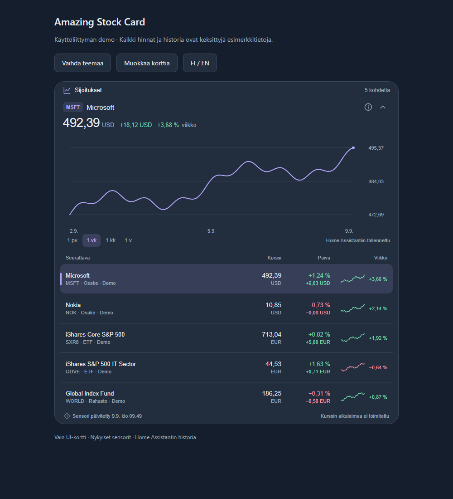

# Amazing Stock Card

Home Assistantin **UI-kortti** osakkeiden, rahastojen, ETF:ien ja indeksien seurantaan. Käyttää nykyisiä kurssisensoreitasi. Avanza Stockin attribuutit tunnistuvat automaattisesti; muiden integraatioiden kentät voi määrittää kortin editorissa.



## Asennus

1. Avaa **HACS → valikko → Mukautetut repositoriot / Custom repositories**.
2. Lisää `https://github.com/raunosr/ha-amazing-stock` ja valitse tyypiksi **Dashboard** (vanhemmissa versioissa **Lovelace**).
3. Lataa **Amazing Stock Card** ja päivitä selain.
4. Muokkaa kojelautaa → lisää kortti → **Amazing Stock Card**.
5. Valitse nykyiset sensorit kortin visuaalisessa editorissa.

Jos korttia ei löydy, tarkista kojelautojen resursseista JavaScript-moduuli `/hacsfiles/ha-amazing-stock/ha-amazing-stock.js`.

Kortti ei tarvitse muutoksia `configuration.yaml`-tiedostoon. Uusien kurssisensorien luominen kuuluu käyttämällesi integraatiolle; kortin editorissa valitaan jo olemassa olevia sensoreita. Pitkää ulkoista historiaa varten on erikseen asennettava [Amazing Stock Data -integraatio](https://github.com/raunosr/ha-amazing-stock-data).

## Käyttö

Seurantalistassa näkyvät nimi, kaupankäyntitunnus, kurssi, valuutta, päivän muutos ja leveässä näkymässä viikon kuvaaja sekä prosenttimuutos. Rivin painaminen avaa kohteen suuren kuvaajan. Jakson voi vaihtaa päiväksi, viikoksi, kuukaudeksi tai vuodeksi; ulkoisella historialla myös **5 vuodeksi, 10 vuodeksi tai MAX-jaksoksi**. Kuvaajan voi piilottaa ja riveistä tehdä tiiviimmät. Pienet kuvaajat voi valita erikseen.

Kortin otsikko on valinnainen: **Näytä kortin otsikko**, **Otsikkoteksti** ja **Otsikon ikoni** löytyvät editorista. YAML-asetukset ovat `show_header`, `title` ja `icon`, esimerkiksi `icon: mdi:finance`. Tyhjä `icon: ""` piilottaa vain ikonin. Suuren kuvaajan avaamispainike säilyy käytössä myös otsikon ollessa piilossa. Valitun kohteen nimi, tunnus, kurssi ja muutos vievät nyt vähemmän tilaa kuvaajan yläpuolella. Pitkä nimi lyhennetään näyttöön; sensorin tiedot saa info-painikkeesta.

Editorissa voit lisätä ja poistaa kortin rivejä, muuttaa järjestystä, nimiä ja kohteen tyyppiä sekä määrittää muiden integraatioiden attribuutit. Sensorin tilan tulee sisältää numeerinen hinta. Valuutta luetaan tavallisesti `unit_of_measurement`-attribuutista. Puuttuvia muutostietoja ei arvata.

Lista on **vieritettävä**. Sections-kojelautanäkymässä kortti noudattaa HA:n Layout-asetuksia ja `grid_options`-määrityksiä. Oletus on `columns: 12` ja `rows: 8`, joten se mahtuu myös HA:n koonvalitsimeen. Lisääminen ei kasvata kortin korkeutta. Otsikot pysyvät paikallaan, ja vierityskohta säilyy kurssipäivityksissä. Kuvaaja madaltuu kortin mukana; enintään 440 pikselin korkuisessa kortissa se piilotetaan, jotta listalle jää tilaa. Masonry-näkymässä listan enimmäiskorkeus on 320 pikseliä.

Oletuksena kuvaajat näyttävät **Home Assistantiin tallentuneen historian**. Vuoden historiaa ei synny, jos HA säilyttää vain muutaman päivän tiedot. Kortti ilmaisee puuttuvan tai osittaisen historian ja erottaa sensorin päivitysajan lähteen mahdollisesta kurssiaikaleimasta. Avanzan datan viive pysyy lähteen mukaisena.

## Ulkoinen historia Avanzasta

1. Lisää HACSissa `https://github.com/raunosr/ha-amazing-stock-data` tyypillä **Integraatio** ja lataa se.
2. Käynnistä HA uudelleen ja lisää **Amazing Stock Data** kohdasta Asetukset → Laitteet ja palvelut.
3. Valitse kortin editorissa **Historian lähde → Avanza**.

Tiliä, API-avainta tai maksullista API-lisenssiä ei tarvita. `sensor.avanza_stock_ID` tunnistetaan automaattisesti. Uudelleennimetylle tai muun integraation sensorille syötä rivin asetuksiin saman pörssilistauksen Avanza-tunnus. Voit käyttää eri lähdettä eri riveillä. Kaupankäyntitunnus, esimerkiksi MSFT, saadaan myös ulkoisesta metadatasta; oma symboliasetus menee sen edelle.

5 vuoden kuvaaja käyttää päivien päätöskursseja, 10 vuoden ja MAX-kuvaaja viikkojen päätöskursseja. MAX tarkoittaa kaikkea Avanzalta saatavaa historiaa kyseiselle listaukselle. Nuoremmilla kohteilla historia alkaa myöhemmin; aiempia vuosia ei täytetä. USA-osakkeet sekä ETF- ja ETP-kohteet on tarkistettu. Muiden kohteiden tuki riippuu Avanzan julkisten päätepisteiden kattavuudesta.

Ulkoisen kuvaajan muutos lasketaan sen ensimmäisestä ja viimeisestä päätöskurssista, ja sen yhteydessä lukee **kuvaaja**. Nykyinen hinta ja listan päivä- ja viikkomuutokset tulevat edelleen sensorista. Kuvaajan lähde ja aikavälien tarkkuus näkyvät sen alla. Eri valuutan historia hylätään. Avanzan rajapinta on epävirallinen, eikä sen datan osinko- tai split-oikaisuista luvata kokonaistuottolaskelmaa. Virhetilanteessa näytetään virhe, ei HA-historiaa pitkänä markkinahistoriana.

Kortin YAML-asetukset ulkoiselle historialle:

```yaml
history_provider: avanza
default_period: five_years
show_header: false
show_chart: true
show_sparklines: true
```

Valinnainen kortin YAML-esimerkki (kojelautaan, ei `configuration.yaml`-tiedostoon):

```yaml
type: custom:amazing-stock-card
title: Sijoitukset
locale: fi
entities:
  - entity: sensor.microsoft
    symbol: MSFT
    kind: stock
  - entity: sensor.indeksirahasto
    kind: fund
default_period: week
```

Vaihda esimerkkien tunnukset omiin olemassa oleviin sensoreihisi. Tarkat asetukset ja muiden lähteiden kenttäkartoitukset ovat [tietosopimuksessa](docs/data-contract.md). [Englanninkielinen ohje](README.md) sisältää manuaalisen asennuksen ja kehitysohjeet.
